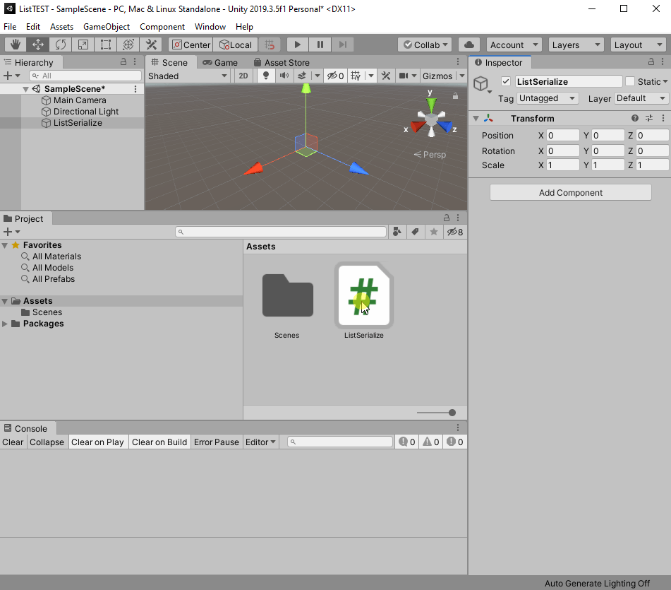

# SerializableReferencesDictionary
A serializable dictionary class for Unity which stores objects as references.

Unity cannot serialize standard dictionaries. This means that they won't show or be edited in the inspector
and they won't be instantiated at startup. Furthermore, Unity only can serialize stored `ScriptableObject`s as references, other object will be serialized by value. Finally this will result in bigger file size and when deserialized in cloned objects instead of recreated references.

This project provides a generic, serializable and reference-based dictionary class (using the new Unity 19.X attribute `SerializeReference`) and its custom property drawer that provides a solution for some of the problems.


This Project is based on the previous work of (https://github.com/azixMcAze/Unity-SerializableDictionary). 

## Background

Currently you can find two different kinds of workarounds in the internet to the lack of serialization of dictionaries:

1. store the keys and values in separate arrays and construct the dictionary at startup (like in this project)
2. recreate a generic dictionary class based only on both a key and a value list and serialize these list (for me, this is the cleaner solution, but has some drawbacks, like in https://forum.unity.com/threads/finally-a-serializable-dictionary-for-unity-extracted-from-system-collections-generic.335797/)
3. using a proprietary save and load system

Both approaches have Pros and Cons. In the first approach Unity have to copy the complete dictionary into two list before these lists will be serialized by the default serialization system. Say, you have to create editor tools (like me), you will find out Unity uses the serialization mechanism not only for storing data but also for the communication between the editor and the data structure in the background (the `serializableobject`). So every time you access the background object Unity will serialize the background object. In the best case, this happens only in every editor update cycle. If you were only working with small dictionaries and if you have a new and fast computer, all would be fine, otherwise, strange things will happen...

The first and the second approach are based on the default unity serialization system. They prepare the data structure to be serializable (approach 1) or uses a serializable data structure in the background (approach 2). Approach 3 just uses the events of the serialization system the store and load the data on its own. The drawback of this approach is you can't easily display the data of the data structure in the inspector.

### But what about objects?

If you stored objects in your lists you probably found out, your objects will be serialized as separate objects even if their references point to the same object. So after having deserialized your data structure, your beautiful object is splitted in independent clones--one for each reference. 

For instance, if you have the following code snipped somewhere in your code of a `Serializable` class, 

```c#
[System.Serializable] public class MyClass { public string id; }
...
public static MyClass anObject = new MyClass { id = "123456" };
public List<MyClass> objList = new List<MyClass>(){ anObject, anObject, anObject };
...
(objList[0] as MyClass).id = "007";
```

This code simply creates a new class `MyClass` with a member `name`. In the `Serializable` Class we define an instance / an object of the `MyClass` class (named `anObject`). We define a list of `MyClass` and add the `anObject` object to the list three times. 

And finally we rename the first item in the list. Because all three list items are references to the same object, all three list items now show the same name (and the object named with `anObject` too). That's the game, until...  Yes, until you close and restart Unity or changing a part of your code and recompile or just start your game, because all these actions will activate the deserialization of Unity. 

Have a look at the following animation. I attach a `MonoBehavior` script to a game object, change the id of the first object (instead defining a button in a separate Editor script, I just use a checkbox as a button replacement). As long as I do provoke a deserialization everything works fine. 



When I restart the game everything looks good, all three list item were showing the same values as expected. But now when if change the id of the first item by clicking the checkbox, only the first item will be changed. The references are lost, only the values were deserialized,

### Working with References

Currently (Mai 2020) there are two solutions to get around this bottle neck:

1. working with stored `ScriptableObject`s
2. using the `[SerializeReference]` attribute (since Unity 19.X)

The first approach uses `ScriptableObject`s to store data independently of a scene in the project folder. In this approach you have to create and store a `ScriptableObject` for each object possibly referenced by more than one serialize member. So if you want to have a list of movies `List<Movie> movies;` and a reference to your all-time-best movie `Movie myFavouriteMovie;` out of the list, you could have two references to one of the movies out of the list. If you do not inherit the `Movie` class from `ScriptableObject`, after deserialization you will have two equal movies which aren't identical.  On the other hand, with `ScriptableObject`s you will have to create and store `Movie` objects for each of your movies. The dangerous part could be the way Unity is remembering the `ScriptableObject`. Referencing takes place by using the GUID of the `ScriptableObject` which is stored in the *{name of the asset}.meta* file. If somebody move `ScriptableObject`s, the meta file will be recreated with a new GUID. References are gone.

If you only want to store some objects, this approach may be the right one for you. In my case, I had to deal with some ten thousands of multiple referenced objects (a graph). Even `null` values should be valid. The process for storing and reloading all these `ScriptableObject`s took so much time, so I finally used a proprietary homebrewed serialization mechanism.

The second approach uses the `[SerializeReference]` attribute (see https://docs.unity3d.com/ScriptReference/SerializeReference.html). This attribute makes it possible to deal with `null` values, interfaces, abstract class and store references instead of cloned wax objects (like in a wax museum: only looks like the original). Cool, right? No, not really. Developers seem to be happy when someone gives them a tiny shovel to dig in their code, whereas an automatic digging robot would actually be standard. But this is another story... (see https://github.com/vexe/VFW/issues/88#issuecomment-213857086 for instance)

What is still not possible with the new attribute is serializing a dictionary. But I am clever! I remember, serializable dictionaries where build on simple list, so why not simply serialize these list with the `[SerializeReference]` attribute and dynamically create the dictionary in the two serialization events `OnBeforeSerialize` and `OnAfterDeserialize`. Easy as 1,2,3, wrote it down and ... the dictionary is empty after deserialization.  

After doing some investigation (a good thing is that it is possible to store ScriptableObjects in human readable text mode as yaml file to get a clue what is happening) I found out that the serialization seems to work and the deserialization too, but the later just *after* the `OnAfterDeserialize`. So if you want to access the deserialized temporary key and value lists, they are still empty. It is not possible to rebuild the dictionary in the `OnAfterDeserialize` event handler method. For me this sounds like a bug or at least like a unlucky design decision.

So what? I created a new member `isOutdated` to indicate rebuilding is necessary and check this flag every time a method tries to access the internal dictionary.  When the dictionary is flagged outdated, the dictionary will be rebuild from the key and value lists.


## Features

- It inherits from `Dictionary<TKey, TValue>`
- It implements a `CopyFrom(IDictionary<TKey, TValue>)` method to help assign values from regular dictionaries
- You can use any serializable type by unity as key or value. 
- It can be edited in the inspector without having to implement custom editors or property drawers.
- The inspector will handle invalid dictionary keys such as duplicated or `null` keys and warn the user that data loss can occur if the keys are not fixed.
  
    

    


## Limitations
- A non-generic derived class has to be created for each `<TKey, TValue>` combination you want to use. A `CustomPropertyDrawer` has to be declared for each of these classes.
- Multiple editing of scripts using `SerializableDictionaries` in the inspector is not supported. The inspector will show the dictionaries but data loss is likely to occur.
- The conflicting key detection does not work when using `LayerMask` as key. The `LayerMask` value is changed after the `CustomPropertyDrawer` execution.
- Dictionaries of lists or arrays must use the 3 arguments `SerializableDictionary<TKey, TValue, TValueStorage>` dictionary class with the extra `SerializableDictionary.Storage<TValue>` class to hold the values. See the "Dictionary of lists or arrays" section for details.


## Usage

### Simple dictionary example 

To create a serializable dictionary of type `<string, string>`:
-  Create a `SerializableDictionary` subclass
    ```csharp
    [Serializable]
    public class StringStringDictionary : SerializableDictionary<string, string> {}
    ```
- Use `StringStringDictionary` in your scripts as a normal `IDictionary<string, string>` type


### Dictionary of lists example 

To create a serializable dictionary of type `<string, List<Color>>`:
- Create a `SerializableDictionary.Storage` subclass to hold the list
    ```csharp
    [Serializable]
    public class ColorListStorage : SerializableDictionary.Storage<List<Color>> {}
    ```

-  Create a `SerializableDictionary` subclass using the previous subclass
    ```csharp
    [Serializable]
    public class StringColorListDictionary : SerializableDictionary<string, List<Color>, ColorListStorage> {}
    ```
- Use `StringColorListDictionary` in your scripts as a normal `IDictionary<string, List<Color>>` type


## Details

As Unity is unable to directly serialize generic types, create a derived class for each `SerializedDictionary` specialization you want.
```csharp
[Serializable]
public class StringStringDictionary : SerializableDictionary<string, string> {}

[Serializable]
public class MyScriptColorDictionary : SerializableDictionary<MyScript, Color> {}
```

You can use your own serializable classes.
```csharp
[Serializable]
public class MyClass
{
    public int i;
    public string str;
}

[Serializable]
public class StringMyClassDictionary : SerializableDictionary<string, MyClass> {}
```


Add the dictionaries to your scripts and access them directly of through a property.
The dictionaries can be accessed through a property of type `IDictionary<TKey, TValue>` for better encapsulation.

```csharp
public StringStringDictionary m_myDictionary1;

[SerializeField]
MyScriptColorDictionary m_myDictionary2;
public IDictionary<MyScript, Color> MyDictionary2
{
    get { return m_myDictionary2; }
    set { m_myDictionary2.CopyFrom (value); }
}

public StringMyClassDictionary m_myDictionary3;
```

The `CopyFrom(value)` method clears the `m_myDictionary2` dictionary and adds to it each of content of the `value` dictionary,  effectively copying `value` into `m_myDictionary2`.

`SerializableDictionary` has a copy constructor from `IDictionary<TKey, TValue>`. As constructors from parent classes cannot be used directly, you have to add a copy constructor to your derived classes calling the base constructor in order to use it.

```csharp
[Serializable]
public class StringColorDictionary : SerializableDictionary<string, Color>
{
    public StringColorDictionary(IDictionary<string, Color> dict) : base(dict) {}
}
```

### Dictionary of lists or arrays

Because unity cannot serialize a array of lists or an array of arrays, using a `SerializableDictionary<TKey, TValue[]>` or a `SerializableDictionary<TKey, List<TValue>>` in a script will not work properly. The dictionary will not show up in the inspector and the values will not be saved.

It is necessary to create an intermediate class that will contain the list or array. This class can then be contained in an array and be serialized by Unity.

Create a class that inherits from `SerializableDictionary.Storage<List<TValue>`. This storage class will only contain a `List<TValue> data` field.

```csharp
[Serializable]
public class ColorListStorage : SerializableDictionary.Storage<List<Color>> {}
```

If you use this storage class directly with SerializableDictionary, you will have to access the list or array through the `.data` field of the `Storage` class because your dictionary will inherit from `Dictionary<TKey, Storage<TValue>>` instead of `Dictionary<TKey, List<TValue>>`. This is far from ideal.

```csharp
// non optimal example for a dictionary of color list
[Serializable]
public class ColorListStorage : SerializableDictionary.Storage<List<Color>> {}
[Serializable]
public class StringColorListDictionary : SerializableDictionary<string, ColorListStorage> {}

public StringColorListDictionary m_colorStringListDict;

// you would have to access the color list through the .data field of ColorListStorage
List<Color> colorList = m_colorStringListDict[key].data;
```

To access the lists directly, use the special 3 arguments `SerializableDictionary<TKey, TValue, TValueStorage>` class where `TValueStorage` is the class previously created.


```csharp
[Serializable]
public class ColorListStorage : SerializableDictionary.Storage<List<Color>> {}
[Serializable]
public class StringColorListDictionary : SerializableDictionary<string, List<Color>, ColorListStorage> {}

public StringColorListDictionary m_colorStringListDict;

// you can now access directly the color list
List<Color> colorList = m_colorStringListDict[key];
```
